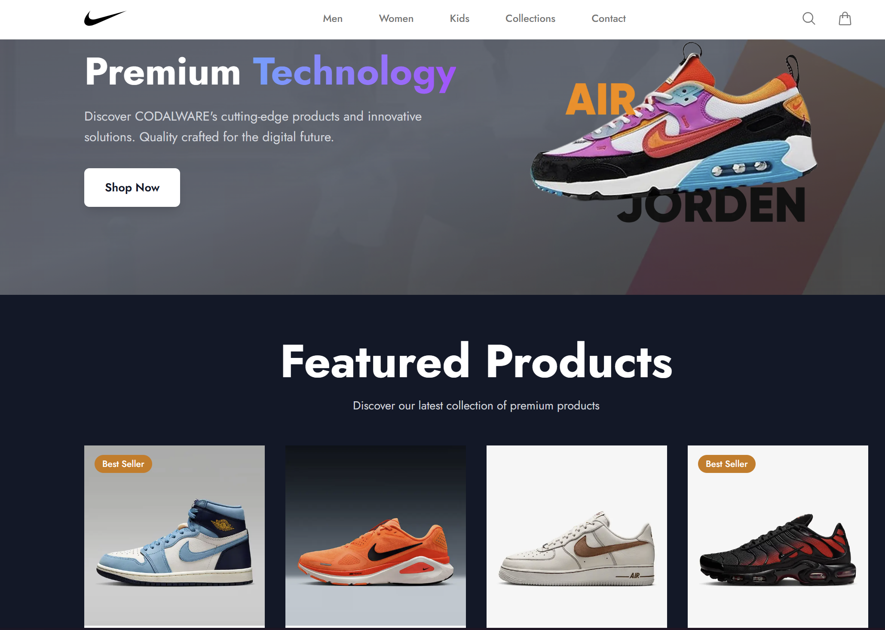

# CODALWARE Store

Modern e-commerce platform built with Next.js 15, featuring premium athletic wear and sneakers.

## Preview



## Features

- Product catalog with CODALWARE shoes and athletic wear
- Shopping cart functionality  
- Responsive design with custom theme
- Custom CODALWARE branding
- Built with Next.js 15 and TypeScript

## Quick Start

1. **Install dependencies**
   ```bash
   npm install
   ```

2. **Set up environment**
   ```bash
   cp .env.example .env.local
   # Add your database URL and auth secret
   ```

3. **Run database setup**
   ```bash
   npm run db:generate
   npm run db:push
   npm run seed
   ```

4. **Start development server**
   ```bash
   npm run dev
   ```

Visit [http://localhost:3000](http://localhost:3000) to view the application.

## Tech Stack

- **Next.js 15** - React framework with App Router
- **TypeScript** - Type safety
- **TailwindCSS** - Styling with custom theme
- **Zustand** - State management
- **Drizzle ORM** - Database toolkit
- **PostgreSQL** - Database

##  Scripts

- `npm run dev` - Development server
- `npm run build` - Production build
- `npm run seed` - Seed database with sample products
